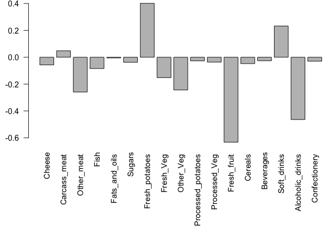

# Class7: Machine Learning 1
Mudit (PID: 911)

Before we get into clustering methods, let’s make some sample to cluster
where we know what the answer should be.

To help whith this I will use the `rnorm()` function

``` r
hist(rnorm(1500000, mean = 3))
```


``` r
hist(c(rnorm(15000, mean = -3), rnorm(15000, mean = 3)))
```


``` r
hist(rnorm(15000, mean = -3, 3))
```


``` r
c(rnorm(1000, mean = -3), rnorm(1000, mean = 3))
```

       [1] -3.8148613261 -3.3210003353 -1.9880804573 -3.3579871524 -3.3468642353
       [6] -2.1584749040 -4.5847937270 -3.9147147537 -2.6606338840 -2.5429205397
      [11] -3.0587784484 -0.4744024827 -2.5564679201  0.1096187954 -2.6660816309
      [16] -1.8206843538 -2.4482803556 -2.6951997381 -3.9393337013 -2.4979783396
      [21] -3.8137164992 -2.2558542555 -4.4637188412 -3.7201133007 -2.1884112119
      [26] -5.0236283518 -2.0543360973 -3.9443955178 -4.3166783948 -3.5866691194
      [31] -5.0228733083 -3.2246864141 -3.6253664932 -5.3893843083 -1.2740347541
      [36] -3.3640113017 -4.1679637795 -4.2555162197 -4.4607823609 -2.9855371361
      [41] -2.7122561275 -2.1778336611 -3.5264437416 -3.7666136766 -3.7332181498
      [46] -4.4551730136 -3.9865675022 -2.2779020047 -3.6377698900 -2.7227304234
      [51] -2.5719334131 -2.7118236009 -3.7007113314 -4.0133819627 -4.3884542225
      [56] -4.9568091909 -2.4219585711 -2.0418708629 -4.4946849020 -2.3493334452
      [61] -3.3107937347 -3.3823589530 -2.1778232350 -4.0099145610 -3.5566947523
      [66] -3.6120824742 -3.8144450995 -2.3483120238 -2.7285895271 -1.8791872628
      [71] -2.7047388237 -3.3536044952 -3.3221920829 -1.4234659366 -3.1995675428
      [76] -2.3966744547 -3.7344386893 -0.2879298267 -4.2535459044 -2.7822801942
      [81] -4.1281901795 -3.6568984124 -4.2055089059 -2.6141474785 -1.3730230316
      [86] -4.0049272049 -2.6244379184 -3.0141496881 -2.8709550437 -2.6404839467
      [91] -2.8440920740 -2.5227632028 -5.1599724349 -4.3194531951 -1.9649825547
      [96] -2.9875594010 -3.8350307938 -3.5808973929 -2.8484100018 -2.8015946294
     [101] -1.6917093689 -2.5469342362 -3.4874829813 -2.3243314356 -1.5007827731
     [106] -5.0206318932 -4.2532787228 -2.6199524234 -2.9568876961 -1.1296553362
     [111] -2.9012567418 -2.2216705261 -3.1058864481 -4.7681230866 -3.8955645572
     [116] -3.3525458635 -3.2558175950 -2.7956957799 -2.6424062409 -1.7092998439
     [121] -1.4531171051 -2.4246985162 -3.8465231832 -2.5867810767 -4.0652695303
     [126] -2.6499044771 -2.8196157353 -3.7604929768 -3.4644522997 -2.4467951382
     [131] -3.3288910567 -3.0510236157 -4.1237327807 -3.9942072977 -2.9127304217
     [136] -2.2964665041 -2.7358882240 -1.8278858296 -2.8911068003 -3.5757955605
     [141] -2.9022509106 -0.2806901234 -4.7560496401 -2.4830196207 -3.1552194002
     [146] -3.3634590541 -3.6302923589 -4.0059069615 -3.6073139332 -2.2507632368
     [151] -3.2314862910 -2.0352047195 -4.4793904532 -2.9516514581 -3.2719036973
     [156] -1.4034499029 -1.4362916844 -2.2040307786 -4.1761029500 -4.6094632362
     [161] -2.0159713769 -1.9216367137 -1.1395315128 -1.3478666729 -2.5606179881
     [166] -3.5835764367 -1.3512406288 -2.6651665527 -2.9451872539 -3.5709093875
     [171] -2.5102567681 -2.0159142988 -2.4143950540 -3.2065393973 -1.8125028047
     [176] -5.1194360509 -2.9632073424 -2.6505324866 -3.4953268668 -4.4546096978
     [181] -6.1379698240 -3.1668944669 -2.1221840471 -4.1739311961 -3.5586349831
     [186] -2.5971483854 -4.8623938674 -3.6943399863 -2.7204624524 -4.9104137276
     [191] -2.5103263204 -4.9583639854 -3.0642277200 -2.4463515957 -1.7040434216
     [196] -3.4588980579 -2.7826663929 -2.8822902627 -1.6231924301 -3.0561665858
     [201] -5.8661383992 -3.7701114385 -1.6419583629 -1.2602693215 -2.7243547088
     [206] -4.9371011617 -4.1520062522 -3.8866719124 -3.7503208418 -3.5496519869
     [211] -2.7430818612 -2.7806246603 -3.1578731439 -3.0845576718 -3.5808167815
     [216] -3.0597291655 -3.6039412621 -4.0211624374 -3.7908098329 -3.3168821989
     [221] -3.3230598439 -4.3305268516 -1.9631587717 -3.5048786873 -2.7848393383
     [226] -5.0776862971 -2.1669779193 -0.7264012757 -4.9948589093 -3.5342408219
     [231] -3.9941425398 -2.3418977243 -3.1704946776 -2.8170103503 -1.8667643383
     [236] -3.8758863093 -3.2619417357 -2.7450843671 -3.2635813541 -2.6794030120
     [241] -3.8631842912 -2.5951723301 -2.8109212970 -2.7413601066 -4.2120193369
     [246] -3.3704986125 -2.4060966928 -4.8356540224 -2.5250766736 -2.6532809640
     [251] -3.7042177325 -3.2007723112 -3.6176589624 -2.4712119809 -4.2142011473
     [256] -3.4769648182 -3.0669902785 -3.0035019306 -2.5863199635 -0.9485433550
     [261] -2.8702193975 -3.9672809709 -2.0456326724 -3.1452453636 -2.9151349706
     [266] -3.0292314874 -2.9555522809 -3.4865883703 -2.8516068671 -0.9746692479
     [271] -2.8372083236 -3.2106900694 -3.0153497990 -2.2794212293 -2.1553690261
     [276] -3.2062686566 -5.0225349656 -4.4595409496 -3.3210556200 -2.9264861312
     [281] -2.2267977558 -4.4850832054 -3.5120256751 -2.1440476683 -2.9583768959
     [286] -1.2070985138 -4.3099738672 -3.3343496931 -2.8707307936 -3.6953718058
     [291] -3.5324388803 -2.3454782139 -2.6819248568 -1.9933646968 -2.3258242876
     [296] -4.7863663773 -1.3743446932 -3.5856778465 -3.5832894759 -4.0255882094
     [301] -3.2539189152 -3.8074251454 -4.6868590923 -6.0352875709 -4.7836271389
     [306] -3.3255935805 -2.2578834054 -1.8395687672 -2.9940314585 -2.5454823107
     [311] -2.7216661764 -1.9771818659 -2.5030023041 -3.4323533934 -4.2550005994
     [316] -3.6947850427 -2.2706518573 -1.8401779794 -2.8224709181 -2.1550945026
     [321] -2.3628655244 -0.8341549213 -2.0651692487 -3.1343507297 -3.0341835765
     [326] -2.6255927996 -1.4914459974 -3.7004658359 -1.9793016635 -2.9589511089
     [331] -4.1735573224 -3.6639405973 -2.5480338689 -2.2434968222 -1.9589859935
     [336] -3.4551626366 -1.8037976923 -3.5747949912 -1.8450017991 -3.8723904669
     [341] -3.0888734165 -4.1363877621 -3.7484434787 -3.7780159061 -2.0187689639
     [346] -3.5378500060 -2.7650004520 -2.5542840800 -2.1031600201 -3.7708023813
     [351] -5.2569512348 -3.4771951959 -2.8007817910 -2.1294901969 -3.6792289992
     [356] -3.2918600857 -3.3191035646 -4.1642489658 -3.4253469130 -2.4251847368
     [361] -4.2701773243 -3.4875569584 -4.2269282109 -3.4778290694 -2.4143130872
     [366] -3.0627614508 -2.1018696011 -3.0590573428 -2.1817686727 -1.6440202729
     [371] -4.2794693487 -3.8557516560 -2.6664473902 -3.3673910228 -2.0952675948
     [376] -3.0972353862 -4.0903598096 -3.5502777105 -4.2061652254 -3.0549275071
     [381] -1.5513855104 -1.1525113238 -5.7072323100 -2.5611158246 -2.9675676642
     [386] -4.0218571689 -4.7452613235 -2.6183199484 -4.4227919169 -2.7219944326
     [391] -1.4352584228 -0.7571023729 -1.2433903200 -4.8919578568 -4.2060782247
     [396] -4.3990361969 -1.6529662575 -2.4513437283 -3.8822244653 -3.4360641583
     [401] -2.7574553930 -1.7945081471 -2.2374989139 -2.8820042150 -3.4951038149
     [406] -3.0731786658 -3.4058506263 -1.6339751154 -3.6050308552 -3.3473508369
     [411] -1.8306476524 -1.7341333600 -1.8811816642 -3.0126564787 -2.7925790938
     [416] -2.3083439636 -1.0698597041 -3.3709126153 -2.2189228215 -3.5405839862
     [421] -1.5580187963 -2.5026729340 -3.6391906791 -3.2354920850 -3.4499441960
     [426] -1.3341759445 -5.1454720572 -3.4273409091 -4.1385024670 -4.0945140503
     [431] -2.7953181120 -3.3875350436 -4.2315251100 -2.7543456515 -2.5128406210
     [436] -3.6957143093 -2.9400586509 -3.0348340041 -2.0881556341 -4.0412494561
     [441] -2.4983980184 -4.2737591718 -3.7094292399 -1.9637750495 -3.7797532040
     [446] -4.0453222231 -2.3620157776 -3.6400141641 -2.2656274976 -2.2350458244
     [451] -2.0578687780 -3.2449633441 -3.7391346854 -3.0188416091 -3.5128587740
     [456] -1.0373419139 -2.7534370482 -2.8563529015 -4.2825418781 -2.3523868890
     [461] -2.7272037561 -3.4985949653 -3.6449792846 -3.8880572365 -4.5176408950
     [466] -3.0412443413 -2.7161316681 -3.2006450708 -3.3737478254 -3.0336757607
     [471] -3.4850430244 -3.9688458266 -3.1050111289 -2.6390857831 -2.9445296094
     [476] -2.6719370787 -1.8770638190 -1.0224448442 -2.0968547452 -2.2937649235
     [481] -4.0588153200 -3.6592396848 -4.3731844785 -1.5604517503 -2.6229801759
     [486] -5.1885500327 -3.0671239521 -3.7322926852 -3.1323312369 -3.8750555364
     [491] -3.0966280776 -2.5432887108 -4.3125696237 -2.8620844935 -3.4538583151
     [496] -1.0070384126 -2.1032788739 -3.6444767586 -0.7459846794 -3.2187778184
     [501] -1.4522121785 -3.0358035354 -2.5266289740 -1.5324592968 -3.4534111884
     [506] -2.8107306687 -2.4137444313 -2.1180903750 -4.0954434174 -2.7424821117
     [511] -4.0670100230 -3.4463896525 -4.6762592622 -2.3297300308 -3.3249715049
     [516] -1.4018168042 -4.4109229089 -3.5095854317 -1.0212363353 -1.6872115772
     [521] -3.5622031907 -4.3128838254 -2.6557606224 -4.0438610534 -2.3147558677
     [526] -4.4736595534 -0.3730651847 -1.9964101204 -3.2669513363 -2.5364317539
     [531] -1.3688209109 -3.4846526363 -2.9162841736 -3.1944339335 -2.6794140373
     [536] -4.8087853693 -4.5804850142 -2.2099894812 -2.0180998131 -2.8669041440
     [541] -0.6305472684 -2.5431923044 -2.4040187336 -3.6428343679 -2.3985713571
     [546] -3.8284800477 -3.6105585588 -3.3918470517 -2.7113710859 -4.0590500297
     [551] -3.9205760271 -3.6321275916 -3.2945289965 -3.3051981577 -2.1827938561
     [556] -2.3544337790 -1.3598743639 -3.2382113601 -2.0990082009 -2.2538590249
     [561] -3.8184702536 -1.4005428468 -3.5702860737 -3.3158633404 -3.4965108284
     [566] -2.5206051707 -2.1860123003 -1.8122684007 -2.0970608273 -3.3871521185
     [571] -4.0616325571 -4.1594990428 -2.5206240813 -3.9312582226 -0.9318390205
     [576] -2.4074541007 -3.5435476905 -0.6419574780 -2.2899794662 -2.8223521600
     [581] -3.0753540236 -1.9090736712 -2.9970777774 -2.8992417848 -4.1231399637
     [586] -3.9875812316 -3.5120752180 -4.2462243308 -2.2507981432 -3.1100601565
     [591] -2.3001422435 -1.8212283534 -2.7561982228 -2.8347396387 -1.6662597335
     [596] -4.6687942449 -3.8284351651 -2.0608909049 -1.8202820437 -3.3327480312
     [601] -2.9503672291 -3.1310795626 -1.9969296148 -3.5855597616 -2.6002571034
     [606] -3.1585502066 -2.5968314392 -5.3355294855 -3.4857397603 -3.4732136592
     [611] -2.4871854644 -2.0888799270 -2.0410999250 -3.2564014931 -3.0350629493
     [616] -2.7384928984 -0.5337616036 -4.0495457799 -2.9904383363 -3.7720641942
     [621] -3.6362358320 -3.1490847727 -2.4950128268 -1.3814270457 -3.0036667099
     [626] -4.7901692280 -3.0561420839 -2.7931304976 -1.3917237001 -2.7929130555
     [631] -4.2674403577 -3.8895779600 -2.7465226294 -3.2475119946 -3.8236731348
     [636] -0.6434938071 -2.8243419393 -3.0042516628 -2.9750445772 -3.0664264858
     [641] -3.1663462159 -2.0066197136 -2.0951604747 -2.8124303006 -2.6460454703
     [646] -0.8935850874 -3.2612732075 -4.1904536919 -4.3043809680 -3.0763384999
     [651] -3.2720963142 -3.8081252365 -2.7102379118 -1.8653327876 -2.2788122398
     [656] -1.7642982953 -4.0083176945 -3.4939964727 -2.0801482133 -2.6519508123
     [661] -3.2238066435 -2.4675313802 -5.3778338676 -2.5489176888 -1.5084687499
     [666] -2.6943236776 -3.0577232672 -3.8031918859 -4.9182628916 -3.0324844760
     [671] -4.8372663755 -2.8446804436 -4.2393134639 -4.0624945794 -3.4780424889
     [676] -2.7015802879 -1.9083781100 -3.8032580538 -3.2093286397 -3.4770363598
     [681] -4.6345325500 -1.6312308021 -3.8779205349 -1.6246497258 -1.2193486202
     [686] -2.2320624395 -4.5761860452 -2.9820112864 -3.0714471548 -1.9643881763
     [691] -1.4519967354 -1.7955248536 -4.0306195255 -3.1559245312 -3.4427188674
     [696] -4.1267766253 -3.2582717904 -2.8861301119 -2.7411277900 -2.3010956923
     [701] -1.6565517174 -1.3336099754 -1.5790361444 -3.5595073643 -2.2221205053
     [706] -1.4590011003 -2.7572879855 -2.6578275595 -2.5406057750 -2.3549089743
     [711] -3.4284516903 -2.5273491981 -1.7959485595 -3.1548373612 -0.9800860258
     [716] -3.6316802025 -3.4727008513 -3.2226062378 -3.8540900801 -2.5380703217
     [721] -3.0797181014 -2.5358351823 -1.2356199874 -2.2340534849 -3.0311465026
     [726] -3.7131957211 -2.4476089575 -2.7602678193 -2.4594690202 -0.8872338931
     [731] -3.5725742156 -3.4686585299 -2.6827187608 -2.0848019272 -3.6656115682
     [736] -4.6115660146 -2.1672120936 -2.8737740449 -3.4009885499 -2.6336641432
     [741] -3.6488063596 -2.8247012130 -3.4303192883 -3.4942044332 -3.3272038561
     [746] -4.9034458179 -3.3272189090 -3.1705484679 -0.2276616567 -4.6213766292
     [751] -1.8695827353 -1.2035940318 -2.8360808031 -2.7571742520 -3.5367201089
     [756] -1.8260526376 -3.4303070414 -2.1942983622 -3.1167799021 -1.3253723375
     [761] -4.7814321849 -2.8462484092 -3.9101076835 -3.3458507044 -4.5633517912
     [766] -2.7777938000 -3.3948581429 -2.8709824509 -2.0194435874 -4.5435924914
     [771] -3.3230429175 -1.9193889585 -2.5739139432 -1.8330603289 -2.7481014742
     [776] -4.3813627595 -4.1182777832 -2.7079254613 -4.9423535310 -3.3671904776
     [781] -2.3666801304 -3.1081943388 -3.1599353927 -3.2855523693 -3.0751776854
     [786] -4.2070855417 -3.7592626160 -4.0936538533 -3.4130049317 -1.0422577372
     [791] -3.0007058050 -3.8990459743 -1.5534856025 -3.4243868626 -3.3892570058
     [796] -2.9358631035 -2.3566362757 -3.3756503904 -2.9351353966 -3.2515103448
     [801] -2.3286144709 -4.0627026781 -2.9584364594 -3.8773381752 -2.5459621784
     [806] -1.8903914339 -2.9273675770 -1.5909563572 -4.3947300841 -2.9714490216
     [811] -2.2262901902 -2.1467718927 -2.0723086124 -4.4646908589 -3.0590501398
     [816] -2.3009556033 -1.2208688805 -1.3104363639 -4.1362961559 -2.0535465196
     [821] -2.6262600994 -2.1752777621 -3.3042562787 -1.7824272303 -4.2145183963
     [826] -1.6209209939 -4.0489612032 -1.8866189277 -2.5954310413 -2.8006735805
     [831] -3.9265748500 -2.1638618923 -3.2299409149 -2.2301779964 -1.9219391919
     [836] -2.5652076451 -3.7485941597 -2.8552126619 -2.1811684484 -1.6563299078
     [841] -2.8011163771 -2.8124436907 -2.0453716259 -3.4053331024 -2.8760201060
     [846] -2.3633365493 -2.2494969735 -3.5676356949 -3.6699151538 -1.8793992471
     [851] -1.9485802730 -2.9992625584 -3.4183606513 -2.2683066674 -4.6011642741
     [856] -3.4568914269 -2.2691934826 -4.4803313564 -2.8932289196 -4.5230783659
     [861] -2.4191334476 -2.6078411228 -1.7009063729 -1.9027202493 -2.2852620266
     [866] -3.8495601462 -2.1821520512 -3.4248379492 -2.2742763023 -2.4972022974
     [871] -1.6922307004 -2.8794098139 -3.5807475923 -3.3948701544 -3.2110770591
     [876] -3.6182010570 -3.2668011484 -2.8984999051 -2.6240517889 -3.9725944671
     [881] -1.1018459808 -3.9585486985 -3.7901633813 -3.4288562176 -2.5872957575
     [886] -3.5331900479 -2.5144679049 -3.1947067256 -3.0251125420 -3.3222003855
     [891] -2.2286022847 -2.8541776228 -2.0689606812 -2.1924193881 -4.1236802020
     [896] -3.0007381895 -3.3505888024 -3.3419083778 -3.8391686208 -2.8869957522
     [901] -1.8239595712 -4.8484945650 -3.9012369750 -3.5746922555 -4.2239190806
     [906] -2.2290416521 -3.3821574528 -3.3555097746 -4.3635628736 -1.5756712589
     [911] -2.5215090722 -2.5249820690 -3.0299644513 -3.1308423194 -3.3185602357
     [916] -3.4100511111 -2.1286444431 -2.6206549564 -2.8950127267 -1.8469484887
     [921] -3.4329569377 -2.7255981784 -4.0353899701 -3.6895610789 -3.3940027625
     [926] -2.8382803041 -3.7532363456 -2.9814910282 -2.4520049240 -2.9678900793
     [931] -3.1553737926 -3.3156528046 -2.6038671390 -1.8972995963 -2.4674142992
     [936] -2.1464173830 -3.2492877292 -1.3165872805 -4.3406729216 -2.6036053533
     [941] -1.2075793521 -4.0898692947 -3.4071012564 -4.1824059915 -4.0737485761
     [946] -2.2968121242 -0.9698710509 -3.0715801937 -3.2593406503 -3.3835044471
     [951] -2.1379894832 -3.6390516013 -4.8078049570 -4.0388853216 -3.0375628449
     [956] -1.6335572663 -3.7540333187 -2.0316707820 -3.3174817719 -2.2011681639
     [961] -3.2026572375 -3.4920496097 -3.9524556380 -1.2066532698 -2.7179421781
     [966] -2.2369037438 -2.4460647628 -2.1978349337 -4.2047490990 -3.8991776415
     [971] -1.7699653435 -3.5574484779 -2.0421493007 -3.0671486533 -2.0579136923
     [976] -3.4874691036 -2.7665836013 -3.7744094320 -4.4689074104 -3.2159469570
     [981] -2.1498765104 -3.5696778093 -1.6762355501 -2.6022167927 -4.7839480812
     [986] -3.3207527700 -1.9663693728 -1.1349943355 -2.6002229657 -3.4116934404
     [991] -1.7274643982 -2.2673140171 -0.7116777418 -2.5605002697 -2.0392448297
     [996] -1.2904917686 -2.6235162197 -2.1151639403 -2.1574778974 -2.4027821660
    [1001]  5.4771004227  2.9480274761  1.5942346416  2.7976947864  4.5434257850
    [1006]  5.0423630605  2.8550058098  2.9060795196  3.3238995098  1.9657125340
    [1011]  3.0588747004  0.9310849250  3.1469018175  3.9188131026  1.1826414417
    [1016]  1.8875889352  2.0315494762  5.0978155795  1.5875482153  2.9310371243
    [1021]  3.4303171792  2.1160559768  1.3419019219  3.0234278886  2.7990905726
    [1026]  2.7805462627  3.0279492168  3.7078251508  3.0953549206  2.6217177108
    [1031]  2.5991289466  1.6745238646  3.7983303074  4.4676308734  3.0213053147
    [1036]  3.3473453036  1.8627809890  2.4705662684  1.5063679921  4.6572656680
    [1041]  4.4012290193  2.3253165940  2.1775820618  3.6240968452  2.8501250199
    [1046]  2.0403249216  1.6595718399  4.6820352053  3.7462302827  3.4154086321
    [1051]  3.1091197945  2.8509975994  3.2735426875  3.6763194996  1.6814814531
    [1056]  4.3414457876  2.1042089900  1.1158995147  2.4940187651  2.0453096722
    [1061]  3.7240063024  3.6989675750  3.0914490097  2.7225932242  1.9698891204
    [1066]  4.8323597271  4.7760029870  2.6402195243  3.2354929538  2.7881038939
    [1071]  4.6095061356  2.9187459410  3.6816780405  1.0659134012  2.2030940557
    [1076]  1.7153576391  2.9704374771  3.5312259577  3.2694581994  3.8656812922
    [1081]  1.8760266110  2.6485813104  0.8046150016  4.5659083618  2.6195948551
    [1086]  2.6335571257  5.0328504035  3.1490266553  3.7709577070  1.3557002144
    [1091]  2.1677287062  3.1066908599  3.3360836967  2.9058107924  3.5759971904
    [1096]  2.6960145004  0.9918364184  5.0212155493  2.5913943303  2.9927647545
    [1101]  3.8992974049  4.7585035840  3.6498984832  2.4705445993  2.5117960716
    [1106]  2.3906544448  3.2719309026  3.3940503792  3.2349487189  3.2545681484
    [1111]  3.3911840529  5.7133690335  0.5081404072  4.2267155070  1.9059522966
    [1116]  3.5746318497  1.8996025853  4.1463600124  2.5869146650  2.0131535394
    [1121]  2.3756668556  2.1230835950  4.5435977256  2.4520007200  2.7785038643
    [1126]  2.2489195451  3.7060011101  1.6748540015  2.8083205593  3.2011651115
    [1131]  1.2338455753  2.5591071852  4.2040223654  3.3070503895  3.5298807157
    [1136]  3.2514572166  2.0007476711  3.1174301085  3.0373668216  2.2002262490
    [1141]  3.7373065223  1.3784700575  2.6241686274  5.5341024468  3.2578353128
    [1146]  3.3047927659  3.4035966991  2.5716774287  2.6216407269  3.8193477109
    [1151]  3.7055386965  2.9236983931  4.2683593686  3.2391380715  1.5563843337
    [1156]  4.9865274823  1.7108315538  2.2718527761  3.1412045130  2.8360050546
    [1161]  2.2628613356  2.3253687373  3.3753882599  1.9811615834  2.9954356559
    [1166]  3.0757561409  2.1391673001  3.8392489287  2.8683465055  3.3933456106
    [1171]  5.8529030454  3.8039203703  3.9612662224  3.2536565767  4.2704666361
    [1176]  3.3705654063  4.1357534029  2.6522527093  2.8071879964  4.1530049586
    [1181]  2.4453336716  4.3426520143  2.8391111239  1.6601966459  2.6974437705
    [1186]  4.0205078714  1.0572171960  2.6188284870  3.0107397490  3.5807807510
    [1191]  4.4183845946  3.8050706015  3.4146700718  3.9894971454  4.8913404812
    [1196]  2.0728680576  4.1288264275  0.9019415139  4.4909457488  2.5071999413
    [1201]  3.1750506748  3.8663999690  3.7852632401  2.2121245062  3.4901333379
    [1206]  1.5598225138  2.9419548552  3.3291543827  2.2401676932  2.7676865780
    [1211]  3.4954332352  1.8339889422  3.5539180821  2.8858450739  4.3871608435
    [1216]  3.2071176626  3.0596565486  3.8210693013  3.3103433433  2.5550765139
    [1221]  2.1316173689  2.4867670641  0.0001298989  2.7267284628  2.3630683638
    [1226]  3.3381545091  2.1357385287  2.6745720049  3.2654592781  3.9487548790
    [1231]  4.4266235269  2.6917127300  1.9864714058  4.7455474427  3.7342657607
    [1236]  3.3773871111  2.9832265448  3.0907624302  2.2497323808  3.5775084506
    [1241]  4.2134541266  4.7561974273  1.7787419104  2.7518338549  2.9467619594
    [1246]  4.1655753522  4.3028904889  1.9203024077  2.6437964082  3.7594484840
    [1251]  3.5209592998  2.9706311465  1.8533070548  3.0767888599  1.2994482910
    [1256]  2.1274726641  2.7088773528  2.6251896092  2.8004491184  3.5372768760
    [1261]  2.7070373865  4.4205338402  2.2960587558  4.8962823228  3.3040910552
    [1266]  2.9463771106  2.6554890713  2.5628302287  4.0440086265  2.0505439301
    [1271]  2.1627261399  2.6549854695  2.9372118070  2.2355479784  3.7434357340
    [1276]  3.0633124262  3.1909913538  3.0210791233  3.1263475993  3.3901849027
    [1281]  2.0177988539  1.2888089630  3.8168485787  2.5810151078  1.8575292806
    [1286]  4.0877085956  4.9464565756  2.1054541331  5.8402832653  3.8345530635
    [1291]  1.5677741817  3.6198701497  3.4144354781  2.5128733526  1.9000101596
    [1296]  3.8410582765  4.4408077310  1.8746070043  2.5357015039  2.1909269246
    [1301]  2.6139587357  1.9885672450  3.6682474603  2.5578133115  1.5906777164
    [1306]  3.1094814358  4.0970643894  3.7398448196  2.1851610509  2.7821012707
    [1311]  2.5623545557  4.7253905048  4.3056257467  3.7881414150  3.9728509475
    [1316]  0.1217679837  3.5147660021  4.0778486089  2.8921056315  2.7019477031
    [1321]  4.4903353983  4.6802606337  3.7357608764  2.8259958564  4.2292924217
    [1326]  3.6562608458  2.7658479966  3.0680445009  2.4258175100  2.2893721130
    [1331]  2.5063791684  2.5612620532  1.8952146918  4.3148590279  3.1849712640
    [1336]  3.4911698031  3.9710190648  1.5308471539  3.6235660240  2.5128345137
    [1341]  2.8753553730  4.7940553924  3.7980580729  1.3663011586  3.3333514454
    [1346]  2.2153905186  3.5756306350  1.9850294255  0.8937045007  3.9928492446
    [1351]  2.8372731552  4.1177029323  2.8401759368  3.2089285353  2.3633042935
    [1356]  1.4474763030  1.2931930086  4.0332406652  2.1103530596  3.4051562457
    [1361]  2.8874283335  2.9069146568  3.6587406741  2.2116381353  3.7249039724
    [1366]  4.6039374755  3.7458318937  3.3384449697  3.1695630324  3.1968644850
    [1371]  3.4244736276  2.0318294772  2.8009767050  2.5316756654  2.2856711447
    [1376]  1.9986318665  3.3541018155  3.6654980317  3.0825459585  3.3764180346
    [1381]  4.8255715771  1.7304361676  3.6772804484  3.7550036281  3.0213626633
    [1386]  2.6780879048  2.3634615103  1.7163408563  2.5512934251  2.1601842697
    [1391]  2.8192001189  3.5122666808  1.6486621817  4.7710180241  1.8043419705
    [1396]  3.6633235715  0.0926490235  1.4398052618  4.2977523536  2.8911674123
    [1401]  4.2373628047  4.1491821959  4.5302146273  2.6453226782  0.9845066718
    [1406]  4.2787274349  3.3138185718  4.3653896146  2.0969407382  4.5586146869
    [1411]  2.1527339411  3.0329091233  3.8078807526  3.5103167266  2.2567196317
    [1416]  0.8821036905  2.4852677283  3.6218063700  4.2834563500  3.6707839164
    [1421]  2.7614169977  4.9893646511  3.0236860953  2.4838398358  2.8038595491
    [1426]  3.1077727729  4.5347953643  2.2648180157  2.9257620527  1.8565379273
    [1431]  3.0107053016  3.1990683955  1.9404849559  3.1871899150  2.5445056545
    [1436]  3.2512046749  2.4420978836  3.3445590101  3.8363420006  1.6238711094
    [1441]  4.7408487163  2.0649648059  3.6316491648  3.4313872928  3.6364774141
    [1446]  4.7771814047  3.2539805869  2.4645811793  3.6749787547  2.3442570928
    [1451]  3.0889365183  2.2492070729  2.8490505455  1.9269112722  3.8252910901
    [1456]  2.7527159181  2.8751797190  3.5933764493  2.8283501063  2.3958340735
    [1461]  4.5729102981  3.5363680467  4.2749265502  2.9976671781  0.7619668998
    [1466]  3.8420094375  2.5982111987  1.9751928252  2.3524638387  2.0653736189
    [1471]  4.1793398213  4.4616358466  3.4100898569  3.0921856940  4.0160682802
    [1476]  3.8329437807  2.0653505526  3.2967641489  1.5296461168  3.8141297497
    [1481]  3.4522501427  1.9586454992  1.8754841758  0.8322751738  3.1218735570
    [1486]  2.3564026083  3.5589119221  2.5782018198  4.5531944835  5.0791127918
    [1491]  1.9840472138  4.7028521364  2.8226843491  3.0205126842  2.6767800122
    [1496]  3.7662186653  4.2491173491  2.5936562102  1.5724256293  2.8018949863
    [1501]  2.2677688533  1.1940042125  4.1631494435  4.1618626015  3.8174538899
    [1506]  3.2018779607  5.1205407240  4.1811665669  1.2046598733  1.6679814190
    [1511]  2.7311751582  3.6867692689  3.5778402607  2.5193401661  1.5663142568
    [1516]  1.4129764603  3.3250227110  2.9032730194  3.6909148156  2.0805570010
    [1521]  2.9249820173  3.7751978488  3.3110429801  2.7396407674  3.6442356989
    [1526]  3.5074343856  3.2702302933  1.7578889468  1.1954658210  1.7370067552
    [1531]  1.5414014331  4.4885154628  3.8470517595  2.9608922814  3.8166437902
    [1536]  2.8108748602  2.9276285949  2.7749190953  4.7148639923  4.5493573195
    [1541]  3.2560751438  3.2710766457  3.0059434813  3.0427010559  0.1665385118
    [1546]  2.4653261062  1.5109154984  1.7317321566  1.8183638418  3.2820808612
    [1551]  1.7216185185  3.2811237025  2.0514905731  2.4233447045  1.8006386000
    [1556]  2.4917356579  3.0930518313  1.7856101100  2.9378687829  2.3551222049
    [1561]  2.2398716130  3.3096377285  1.7483746471  2.6238742320  3.1845873353
    [1566]  2.4311826115  2.0568273033  1.5812916993  1.8924594060  3.4822338604
    [1571]  3.7287606111  2.5732389759  2.7264257944  4.0433557008  2.2946349289
    [1576]  3.2721260537  3.9722353339  3.6459892211  0.9657888077  4.1788816417
    [1581]  5.1910838729  3.1024195437  4.1110697248  2.2273638262  4.2612161848
    [1586]  2.1145337624  1.4641183956  1.6680704494  3.5661809892  2.8405730101
    [1591]  2.8233091908  2.9093058967  3.6452345408  1.8536790924  2.6879684407
    [1596]  4.3575697131  2.6119090727  2.7343562763  1.2361042165  2.4297678874
    [1601]  3.8317961833  2.8281429510  3.2187186827  2.6616418297  6.0002647282
    [1606]  4.5065212083  3.7381951633  2.5388534878  2.6030979925  1.6357164576
    [1611]  1.1763498310  1.4262723851  2.2901412898  2.7995572846  2.1482611661
    [1616]  3.7629153441  2.7751132421  3.9562604683  4.9671152771  3.1612895867
    [1621]  2.3008120094  4.7723227544  3.6501982119  4.5931576091  2.0463834721
    [1626]  4.1387735554  3.4768467958  0.9587379407  3.0882775938  5.5134325757
    [1631]  4.4300572066  3.9787110210  3.2867790822  3.4451207486  1.3557599464
    [1636]  4.1986879288  3.7551593553  4.1903382258  3.3424050794  2.1446328534
    [1641]  2.8482549351  0.3355522493  3.4712019394  3.2430765205  5.0331142972
    [1646]  3.2984140391  4.2122566710  2.4590966197  1.0399103737  2.2347686080
    [1651]  2.1078090054  2.7164717226  4.4063086628  3.8744866991  3.3060002336
    [1656]  2.2433469948  2.2153225039  2.4469494669  1.8005210567  2.4359832013
    [1661]  4.5603181604  3.9340639840  2.3770493549  2.7818589701  2.9784926912
    [1666]  2.3285967730  3.0979826420  1.8909482426  2.3744561592  3.2072561389
    [1671]  3.4669230583  2.4230774865  3.9453018846  4.2345486410  2.3358151572
    [1676]  2.9725985330  2.7325026102  2.2785799806  3.7322528014  2.8145893739
    [1681]  1.7509281030  2.8175136248  3.4362750912  3.2913755847  2.4969958390
    [1686]  4.2853237081  2.3859121654  3.3767252477  4.3278010926  1.5231118103
    [1691]  2.1830441921  2.6241626032  2.4429958801  3.7670967767  2.9086664048
    [1696]  1.6429913630  3.1591895115  3.1489514496  3.8741603897  2.1742488241
    [1701]  0.7021985835  3.6165347491  3.8574574156  2.6343474602  5.4917648686
    [1706]  3.3691854848  2.2137387136  2.5489599434  3.0215071991  3.6190624206
    [1711]  3.6532675760  2.0805673940  4.0276342417  3.9801388205  3.5280019046
    [1716]  3.0234282955  1.7903022097  1.7913227895  1.9259679046  3.0567237225
    [1721]  2.5619689858  2.3085454486  3.6844407757  2.8028899371  2.2463528693
    [1726]  3.7223283275  4.2162139437  2.2983097837  3.4096028890  4.1017377931
    [1731]  1.6150626921  1.8659119417  3.0373867010  3.1362307999  4.8827938896
    [1736]  3.8343159034  2.9174948396  4.6519293602  2.3606949195  4.6698799130
    [1741]  2.2980994243  1.4656853989  3.1648037966  1.1149099460  3.5574514618
    [1746]  1.5593898163  2.7629026343  4.3984073758  4.0974256758  3.9086232962
    [1751]  3.1691002217  1.6703809162  2.5346389398  2.6612486452  3.0646485368
    [1756]  3.3611848631  3.6036602021  4.1669165371  2.7205967387  1.4335850183
    [1761]  1.5982211810  2.9738508744  3.2236341219  2.5743368835  3.3055152926
    [1766]  0.5057974871  4.7624957446  3.5238730473  2.1107456346  3.9545160045
    [1771]  5.4691407660  1.7246197402  3.0071492078  4.9811630077  1.9344502360
    [1776]  5.3312320476  2.4210730359  2.1015848322  0.5026915807  3.2871948625
    [1781]  3.4791823961  4.0305569510  1.3784723868  0.8541942742  2.7730979298
    [1786]  2.9333976761  3.3862036087  3.6502244019  1.7747225442  2.5992986750
    [1791]  3.2429434795  2.4079628403  3.3526202898  3.1697057430  3.9254527133
    [1796]  2.5146070433  2.9080471750  2.2441628395  3.7309989532  2.6198526957
    [1801]  3.3036033680  3.5171201469  4.0331974866  3.1976875743  4.3536110304
    [1806]  2.2626614425  3.0781083117  2.5695806606  4.1772516033  0.5761371873
    [1811]  2.9723186696  0.6629659051  3.6947503474  2.9278936242  2.6083348909
    [1816]  3.0330487959  1.4879543862  1.3465743441  5.5888411344  3.3813218400
    [1821]  2.5261470182  3.0313240004  2.4554966368  1.3609141644  3.3191347599
    [1826]  3.6125035855  2.7949729262  3.8858498147  2.6835252660  0.8931824544
    [1831]  3.6672355458  3.9263647753  1.2633599297  3.3433042036  2.5129342416
    [1836]  3.4959239743  1.6217229525  2.1233866287  2.2148605545  3.3797094878
    [1841]  3.2807402879  2.9176063430  4.5485353006  2.5894819427  2.3568942312
    [1846]  4.4438404167  1.8719925341  2.3957878994  2.8692642218  1.4234378665
    [1851]  2.7605747584  4.9395132211  3.1594654848  2.4054650634  2.0249489743
    [1856]  1.2820271774  2.1007163158  3.0553254636  3.5774193021  2.4678457286
    [1861]  2.2714182365  4.3182556821  1.2801650663  3.6592700559  2.8143190935
    [1866]  3.4817992644  3.6019992471  4.6445420770  1.9360929168  2.6708354360
    [1871]  3.4560896123  2.9617057303  3.2427819665  2.3421579799  0.5045582179
    [1876]  3.0084460734  2.1120894142  3.7985790118  1.8794302997  2.6388773620
    [1881]  2.0807661637  2.6382869689  3.3856252362  1.5672799864  3.1835494600
    [1886]  2.6954007386  2.6158925806  2.5512126111  3.2713914585  3.6328572788
    [1891]  2.2757769580  2.8980649288  3.4715412977  2.7184157921  3.9809791790
    [1896]  2.5284421077  3.9067796409  2.8290823525  2.7265559632  4.2597702778
    [1901]  3.2548905964  4.1371717938  4.1301334853  4.4118088686  3.8097632777
    [1906]  2.4158843308  3.0754420785  2.0145498873  2.1072407599  1.3067607355
    [1911]  2.5153276401  3.0389355226  1.9906457399  3.9494937561  4.4518004722
    [1916]  2.6182615038  2.5420001676  2.3205511012  3.2561519147  4.2962654062
    [1921]  0.7457696012  2.8125900461  3.3640890684  1.8509635156  2.9399527691
    [1926]  0.8788114473  5.1350396196  2.9913472975  4.4879098023  2.0824890185
    [1931]  3.1259033212  3.7208127992  4.3464777636  3.4368095012  3.4127951343
    [1936]  0.1333962158  2.9575869300  3.1622662805  2.1092904580  2.3346751800
    [1941]  2.7961913812  2.8009954873  4.1739805407  3.8050571337  2.8506307845
    [1946]  3.7967038872  2.6018535287  1.8450859396  0.0624282000  4.2429973375
    [1951]  3.6424162831  2.0599306908  5.4861841120  4.0559655882  1.9829408421
    [1956]  3.3692641873  1.2514366768  0.2506951497  4.1331579336  4.1207618861
    [1961]  2.2924748959  3.3677059488  3.3677626611  2.0333298046  2.5773464959
    [1966]  5.4886109618  4.4597985123  3.8112188770  2.4826381141  3.0303851958
    [1971]  1.7214745856  3.7577179081  3.9359539354  1.7485406450  3.9446683201
    [1976]  3.5098860860  2.9759932274  2.2897357363  4.1355553200  2.9110032517
    [1981]  3.1207977637  3.1014714754  1.5311588213  3.2402871813  3.9112432935
    [1986]  3.5664014315  1.5132147083  1.3045391131  1.6828538792  1.4235027886
    [1991]  5.7575804305  2.3546842875  0.4011909211  2.2712504999  2.2825662089
    [1996]  2.6372874176  2.2940304706  2.3484413069  1.9168943017  2.0862663292

``` r
n = 30
x <- c(rnorm(n, mean = -3), rnorm(n, mean = 3))
y <- rev(x)

z <- cbind(x, y)
z
```

                   x          y
     [1,] -2.9656659  2.7066800
     [2,] -1.3777758  3.8011661
     [3,] -4.1183788  4.1225916
     [4,] -0.9862311  2.6624656
     [5,] -2.1680099  1.5993854
     [6,] -2.4793059  1.5921116
     [7,] -2.9548304  1.2440102
     [8,] -3.2524439  1.6010886
     [9,] -3.4216100  2.4934253
    [10,] -2.0082540  3.6030697
    [11,] -3.9404266  2.7927382
    [12,] -3.0802325  4.8541974
    [13,] -3.2308853  2.3605177
    [14,] -3.2012317  4.3586279
    [15,] -5.0144374  2.7526078
    [16,] -2.6172365  2.5748458
    [17,] -3.8912768  3.5380975
    [18,] -4.0618577  2.4274316
    [19,] -2.9213837  2.5641786
    [20,] -3.6077315  4.0043776
    [21,] -2.4836106  3.2238843
    [22,] -3.0356013  2.5786055
    [23,] -3.7762996  3.3959913
    [24,] -3.0641904  0.9610654
    [25,] -3.9843632  2.2879752
    [26,] -2.0804806  4.5528848
    [27,] -3.2111235  4.0159763
    [28,] -2.6112612  3.2968956
    [29,] -1.4292200  2.2374673
    [30,] -1.1366712  3.7067955
    [31,]  3.7067955 -1.1366712
    [32,]  2.2374673 -1.4292200
    [33,]  3.2968956 -2.6112612
    [34,]  4.0159763 -3.2111235
    [35,]  4.5528848 -2.0804806
    [36,]  2.2879752 -3.9843632
    [37,]  0.9610654 -3.0641904
    [38,]  3.3959913 -3.7762996
    [39,]  2.5786055 -3.0356013
    [40,]  3.2238843 -2.4836106
    [41,]  4.0043776 -3.6077315
    [42,]  2.5641786 -2.9213837
    [43,]  2.4274316 -4.0618577
    [44,]  3.5380975 -3.8912768
    [45,]  2.5748458 -2.6172365
    [46,]  2.7526078 -5.0144374
    [47,]  4.3586279 -3.2012317
    [48,]  2.3605177 -3.2308853
    [49,]  4.8541974 -3.0802325
    [50,]  2.7927382 -3.9404266
    [51,]  3.6030697 -2.0082540
    [52,]  2.4934253 -3.4216100
    [53,]  1.6010886 -3.2524439
    [54,]  1.2440102 -2.9548304
    [55,]  1.5921116 -2.4793059
    [56,]  1.5993854 -2.1680099
    [57,]  2.6624656 -0.9862311
    [58,]  4.1225916 -4.1183788
    [59,]  3.8011661 -1.3777758
    [60,]  2.7066800 -2.9656659

``` r
plot(z)
```


## K-means clustering

The function in base R for k-means clustering is called `kmeans()`.

``` r
km <- kmeans(z, centers = 2)
km
```

    K-means clustering with 2 clusters of sizes 30, 30

    Cluster means:
              x         y
    1  2.930372 -2.937068
    2 -2.937068  2.930372

    Clustering vector:
     [1] 2 2 2 2 2 2 2 2 2 2 2 2 2 2 2 2 2 2 2 2 2 2 2 2 2 2 2 2 2 2 1 1 1 1 1 1 1 1
    [39] 1 1 1 1 1 1 1 1 1 1 1 1 1 1 1 1 1 1 1 1 1 1

    Within cluster sum of squares by cluster:
    [1] 55.33785 55.33785
     (between_SS / total_SS =  90.3 %)

    Available components:

    [1] "cluster"      "centers"      "totss"        "withinss"     "tot.withinss"
    [6] "betweenss"    "size"         "iter"         "ifault"      

``` r
km$centers
```

              x         y
    1  2.930372 -2.937068
    2 -2.937068  2.930372

> Q. Print out the membership factor (i.e. our main answer)

``` r
km$cluster
```

     [1] 2 2 2 2 2 2 2 2 2 2 2 2 2 2 2 2 2 2 2 2 2 2 2 2 2 2 2 2 2 2 1 1 1 1 1 1 1 1
    [39] 1 1 1 1 1 1 1 1 1 1 1 1 1 1 1 1 1 1 1 1 1 1

``` r
cl <- kmeans(z, centers = 2)
plot(z, col = cl$cluster)
```


``` r
plot(z, col = c("red", "blue"))
```


``` r
#points(cl$centers, col = 1:5, pch = 8)
```

``` r
#color by number
plot(z, col = c(1,3))
```


plot with clustering result

``` r
plot(z, col = cl$cluster)
points(cl$centers, col = "blue", pch = 17, cex = 2)
```


> Q. Can you cluster our data i `z` into four clusters

``` r
cl <- kmeans(z, centers = 4)
plot(z, col = cl$cluster)
points(cl$centers, col = "blue", pch = 17, cex = 2)
```


\##Hierarchical Clustering

The main funtion for hierarchical clustering in base R is called
`hclust()`

Unlike K-means (`kmeans`) I can not just pass mu data as input, first I
need a distance matirx from my data.

``` r
d <- dist(z)
hc <- hclust(d)
hc
```


    Call:
    hclust(d = d)

    Cluster method   : complete 
    Distance         : euclidean 
    Number of objects: 60 

``` r
plot(hc)
abline(h=10, col = 'red')
```


TO get my clustering results (i.e. the membership vector), I can “cut”
my tree/dendrogram at a given eight. To do this I will use the
`cutree()`

``` r
grps <- cutree(hc, h =10)
plot(z, col = grps)
```


# Principle Component Analysis

Principal component analysis (PCA) is a well established “multivariate
statistical technique” used to reduce the dimensionality of a complex
data set to a more manageable number (typically 2D or 3D). This method
is particularly useful for highlighting strong paterns and relationships
in large datasets (i.e. revealing major similarities and diferences)
that are otherwise hard to visualize. As we will see again and again in
this course PCA is often used to make all sorts of bioinformatics data
easy to explore and visualize.

## PCA of UK food data

``` r
url <- "https://tinyurl.com/UK-foods"
x <- read.csv(url)
```

> Q1. How many rows and columns are in your new data frame named x?

``` r
 # What R functions could you use to answer this questions?
dim(x)
```

    [1] 17  5

``` r
#gives number of rows & columns
```

``` r
## Preview the first 6 rows
head(x, 6)
```

                   X England Wales Scotland N.Ireland
    1         Cheese     105   103      103        66
    2  Carcass_meat      245   227      242       267
    3    Other_meat      685   803      750       586
    4           Fish     147   160      122        93
    5 Fats_and_oils      193   235      184       209
    6         Sugars     156   175      147       139

``` r
# Note how the minus indexing works
rownames(x) <- x[,1]
x <- x[,-1]
head(x)
```

                   England Wales Scotland N.Ireland
    Cheese             105   103      103        66
    Carcass_meat       245   227      242       267
    Other_meat         685   803      750       586
    Fish               147   160      122        93
    Fats_and_oils      193   235      184       209
    Sugars             156   175      147       139

``` r
dim(x)
```

    [1] 17  4

``` r
x <- read.csv(url, row.names=1)
head(x)
```

                   England Wales Scotland N.Ireland
    Cheese             105   103      103        66
    Carcass_meat       245   227      242       267
    Other_meat         685   803      750       586
    Fish               147   160      122        93
    Fats_and_oils      193   235      184       209
    Sugars             156   175      147       139

> Q2. Which approach to solving the ‘row-names problem’ mentioned above
> do you prefer and why? Is one approach more robust than another under
> certain circumstances?

I prefer ‘x \<- read.csv(url, row.names=1)’ as the other methods keeps
on overwritting the rownames as the next column on the left and we loose
the data.

``` r
barplot(as.matrix(x), beside=T, col=rainbow(nrow(x)))
```


> Q3: Changing what optional argument in the above barplot() function
> results in the following plot?

``` r
barplot(as.matrix(x), beside=F, col=rainbow(nrow(x)))
```


> Q5: Generating all pairwise plots may help somewhat. Can you make
> sense of the following code and resulting figure? What does it mean if
> a given point lies on the diagonal for a given plot?

The plot gives the scatter plot between all pairs of country for all
rows in the data.

if a given point lies on the diagonal for a given plot then that
particular food is consumed in equal quantity in both the countries of
that corresponding plot.

``` r
pairs(x, col=rainbow(10), pch=16)
```


> Q6. What is the main differences between N. Ireland and the other
> countries of the UK in terms of this data-set?

Looking at this plot we can say Northern Ireland is somewhat different
from rest of the countries based on the consumption of foods in the data
provided

``` r
pairs(x, col=rainbow(10), pch=16)
```


``` r
#The plot here gives matrix kind of plots where each plot is a scatter plot
```

## PCA to the rescue

The main function to do PCA in base R is called `prcomp`

Note that I need to take the transpose of this particular data as that
is what `prcomp()` help page was asking for

``` r
pca <- prcomp(t(x))
summary(pca)
```

    Importance of components:
                                PC1      PC2      PC3       PC4
    Standard deviation     324.1502 212.7478 73.87622 3.176e-14
    Proportion of Variance   0.6744   0.2905  0.03503 0.000e+00
    Cumulative Proportion    0.6744   0.9650  1.00000 1.000e+00

Let’s see what is inside our result object `pca` that we just
calculated:

``` r
attributes(pca)
```

    $names
    [1] "sdev"     "rotation" "center"   "scale"    "x"       

    $class
    [1] "prcomp"

``` r
pca$x
```

                     PC1         PC2        PC3           PC4
    England   -144.99315   -2.532999 105.768945 -4.894696e-14
    Wales     -240.52915 -224.646925 -56.475555  5.700024e-13
    Scotland   -91.86934  286.081786 -44.415495 -7.460785e-13
    N.Ireland  477.39164  -58.901862  -4.877895  2.321303e-13

> Q7. Complete the code below to generate a plot of PC1 vs PC2. The
> second line adds text labels over the data points.

``` r
# Plot PC1 vs PC2
plot(pca$x[,1], -pca$x[,2], xlab="PC1", ylab="PC2", xlim=c(-270,500))
text(pca$x[,1], -pca$x[,2], labels=rownames(pca$x))
```


> Q8. Customize your plot so that the colors of the country names match
> the colors in our UK and Ireland map and table at start of this
> document.

``` r
# Define country names and their corresponding colors
country_names <- colnames(x)
country_colors <- c("England" = "blue", "Scotland" = "green", "Wales" = "red", "N. Ireland" = "orange")

# Plot PC1 vs PC2 with customized colors for country names
plot(pca$x[,1], -pca$x[,2], xlab = "PC1", ylab = "PC2", xlim = c(-270, 500), col = country_colors[country_names], pch = 16)

# Add country names as labels with their corresponding colors
text(pca$x[,1], -pca$x[,2], labels = country_names, col = country_colors[country_names], pos = 4)
```


To make our main result figure, called a “PC plot” (or “score plot”,
“ordination plot”, or “PC1 vs PC2 plot”)

``` r
plot(pca$x[,1], pca$x[,2], col = c("black", "red", "blue", "darkgreen"), pch = 16, xlab="PC1 (67.4%)", ylab="PC2 (29.0%)", xlim=c(-270,500))
text(pca$x[,1], pca$x[,2], colnames(x))
abline(h = 0, col="gray", lty = 2)
abline(v = 0, col="gray", lty = 2)
```


## Variable loadings plot

can give us insights on how original varibales in

``` r
## Lets focus on PC1 as it accounts for > 90% of variance 
par(mar=c(10, 3, 0.35, 0))
barplot( pca$rotation[,1], las=2 )
```


``` r
pca$rotation
```

                                 PC1          PC2         PC3          PC4
    Cheese              -0.056955380  0.016012850  0.02394295 -0.694538519
    Carcass_meat         0.047927628  0.013915823  0.06367111  0.489884628
    Other_meat          -0.258916658 -0.015331138 -0.55384854  0.279023718
    Fish                -0.084414983 -0.050754947  0.03906481 -0.008483145
    Fats_and_oils       -0.005193623 -0.095388656 -0.12522257  0.076097502
    Sugars              -0.037620983 -0.043021699 -0.03605745  0.034101334
    Fresh_potatoes       0.401402060 -0.715017078 -0.20668248 -0.090972715
    Fresh_Veg           -0.151849942 -0.144900268  0.21382237 -0.039901917
    Other_Veg           -0.243593729 -0.225450923 -0.05332841  0.016719075
    Processed_potatoes  -0.026886233  0.042850761 -0.07364902  0.030125166
    Processed_Veg       -0.036488269 -0.045451802  0.05289191 -0.013969507
    Fresh_fruit         -0.632640898 -0.177740743  0.40012865  0.184072217
    Cereals             -0.047702858 -0.212599678 -0.35884921  0.191926714
    Beverages           -0.026187756 -0.030560542 -0.04135860  0.004831876
    Soft_drinks          0.232244140  0.555124311 -0.16942648  0.103508492
    Alcoholic_drinks    -0.463968168  0.113536523 -0.49858320 -0.316290619
    Confectionery       -0.029650201  0.005949921 -0.05232164  0.001847469

``` r
## Lets focus on PC1 as it accounts for > 90% of variance 
par(mar=c(10, 3, 0.35, 0))
barplot( pca$rotation[,1], las=2 )
```



Below we can use the square of pca\$sdev , which stands for “standard
deviation”, to calculate how much variation in the original data each PC
accounts for.

``` r
v <- round( pca$sdev^2/sum(pca$sdev^2) * 100 )
v
```

    [1] 67 29  4  0

``` r
## or the second row here...
z <- summary(pca)
z$importance
```

                                 PC1       PC2      PC3          PC4
    Standard deviation     324.15019 212.74780 73.87622 3.175833e-14
    Proportion of Variance   0.67444   0.29052  0.03503 0.000000e+00
    Cumulative Proportion    0.67444   0.96497  1.00000 1.000000e+00

This information can be summarized in a plot of the variances
(eigenvalues) with respect to the principal component number
(eigenvector number), which is given below.

``` r
barplot(v, xlab="Principal Component", ylab="Percent Variation")
```


## Digging deeper (variable loadings)

We can also consider the influence of each of the original variables
upon the principal components (typically known as loading scores). This
information can be obtained from the prcomp() returned \$rotation
component. It can also be summarized with a call to biplot(), see below:

``` r
## Lets focus on PC1 as it accounts for > 90% of variance 
par(mar=c(10, 3, 0.35, 0))
barplot( pca$rotation[,1], las=2 )
```


> Q9: Generate a similar ‘loadings plot’ for PC2. What two food groups
> feature prominantely and what does PC2 maninly tell us about?

``` r
## Lets focus on PC1 as it accounts for > 90% of variance 
par(mar=c(10, 3, 0.35, 0))
barplot( pca$rotation[,2], las=2 )
```


## Using ggplot for these figures

We could use the ggplot2 package to make somewhat better figures than
all of the above “base” R plots() and barplots(). Recall that ggplot
works with data.frames and unfortunately most of the output of these
older base R functions like prcomp() are lists of vectors and matrices.

So first we will need to take whatever it is we want to plot and convert
it to a data.frame with the as.data.frame() function. Then to make our
plotting life easier we will also add the food labels as a column
(called “Food”) to this data frame with the rownames_to_column()
function from the tibble package (you might need to install this):

``` r
library(ggplot2)

df <- as.data.frame(pca$x)
df_lab <- tibble::rownames_to_column(df, "Country")

# Our first basic plot
ggplot(df_lab) + 
  aes(PC1, -PC2, col=Country) + 
  geom_point()
```


And then we can get carried away and make this look much nicer:

``` r
ggplot(df_lab) + 
  aes(PC1, -PC2, col=Country, label=Country) + 
  geom_hline(yintercept = 0, col="gray") +
  geom_vline(xintercept = 0, col="gray") +
  geom_point(show.legend = FALSE) +
  geom_label(hjust=1, nudge_x = -10, show.legend = FALSE) +
  expand_limits(x = c(-300,500)) +
  xlab("PC1 (67.4%)") +
  ylab("PC2 (28%)") +
  theme_bw()
```


Let’s do the same for our loadings/PC contributions figures. This data
is stored in the pca\$rotation object that we convert to a data frame,
add the useful row names as a new column and then plot and customize
with additional ggplot layers. Which do you prefer, base graphics or
ggplot?

``` r
ld <- as.data.frame(pca$rotation)
ld_lab <- tibble::rownames_to_column(ld, "Food")

ggplot(ld_lab) +
  aes(PC1, Food) +
  geom_col()
```


We can now add some additional features to the plot, such as reordering
the y axis by the PC1 loadings and selecting a rather ugly color scale
(to match our country colors) and our prefered theme layer.

``` r
ggplot(ld_lab) +
  aes(PC1, reorder(Food, PC1), bg=PC1) +
  geom_col() + 
  xlab("PC1 Loadings/Contributions") +
  ylab("Food Group") +
  scale_fill_gradient2(low="purple", mid="gray", high="darkgreen", guide=NULL) +
  theme_bw()
```


## The inbuilt biplot() can be useful for small datasets

``` r
biplot(pca)
```


## 2. PCA of RNA-seq data

RNA-seq results often contain a PCA (or related MDS plot). Usually we
use these graphs to verify that the control samples cluster together.
However, there’s a lot more going on, and if you are willing to dive in,
you can extract a lot more information from these plots. The good news
is that PCA only sounds complicated. Conceptually, as we have hopefully
demonstrated here and in the lecture, it is readily accessible and
understandable.

In this example, a small RNA-seq count data set (available from the
class website (expression.csv and the tinyurl short link:
“https://tinyurl.com/expression-CSV” ) is read into a data frame called
rna.data where the columns are individual samples (i.e. cells) and rows
are measurements taken for all the samples (i.e. genes).

``` r
url2 <- "https://tinyurl.com/expression-CSV"
rna.data <- read.csv(url2, row.names=1)
head(rna.data)
```

           wt1 wt2  wt3  wt4 wt5 ko1 ko2 ko3 ko4 ko5
    gene1  439 458  408  429 420  90  88  86  90  93
    gene2  219 200  204  210 187 427 423 434 433 426
    gene3 1006 989 1030 1017 973 252 237 238 226 210
    gene4  783 792  829  856 760 849 856 835 885 894
    gene5  181 249  204  244 225 277 305 272 270 279
    gene6  460 502  491  491 493 612 594 577 618 638

> Q10: How many genes and samples are in this data set?

``` r
dim(rna.data)
```

    [1] 100  10

The data set has 100 genes and 10 samples

``` r
## Again we have to take the transpose of our data 
pca <- prcomp(t(rna.data), scale=TRUE)
 
## Simple un polished plot of pc1 and pc2
plot(pca$x[,1], pca$x[,2], xlab="PC1", ylab="PC2")
```


``` r
summary(pca)
```

    Importance of components:
                              PC1    PC2     PC3     PC4     PC5     PC6     PC7
    Standard deviation     9.6237 1.5198 1.05787 1.05203 0.88062 0.82545 0.80111
    Proportion of Variance 0.9262 0.0231 0.01119 0.01107 0.00775 0.00681 0.00642
    Cumulative Proportion  0.9262 0.9493 0.96045 0.97152 0.97928 0.98609 0.99251
                               PC8     PC9      PC10
    Standard deviation     0.62065 0.60342 3.457e-15
    Proportion of Variance 0.00385 0.00364 0.000e+00
    Cumulative Proportion  0.99636 1.00000 1.000e+00

``` r
plot(pca, main="Quick scree plot")
```


``` r
## Variance captured per PC 
pca.var <- pca$sdev^2

## Percent variance is often more informative to look at 
pca.var.per <- round(pca.var/sum(pca.var)*100, 1)
pca.var.per
```

     [1] 92.6  2.3  1.1  1.1  0.8  0.7  0.6  0.4  0.4  0.0

``` r
barplot(pca.var.per, main="Scree Plot", 
        names.arg = paste0("PC", 1:10),
        xlab="Principal Component", ylab="Percent Variation")
```


``` r
## A vector of colors for wt and ko samples
colvec <- colnames(rna.data)
colvec[grep("wt", colvec)] <- "red"
colvec[grep("ko", colvec)] <- "blue"

plot(pca$x[,1], pca$x[,2], col=colvec, pch=16,
     xlab=paste0("PC1 (", pca.var.per[1], "%)"),
     ylab=paste0("PC2 (", pca.var.per[2], "%)"))

text(pca$x[,1], pca$x[,2], labels = colnames(rna.data), pos=c(rep(4,5), rep(2,5)))
```


``` r
library(ggplot2)

df <- as.data.frame(pca$x)

# Our first basic plot
ggplot(df) + 
  aes(PC1, PC2) + 
  geom_point()
```


``` r
# Add a 'wt' and 'ko' "condition" column
df$samples <- colnames(rna.data) 
df$condition <- substr(colnames(rna.data),1,2)

p <- ggplot(df) + 
        aes(PC1, PC2, label=samples, col=condition) + 
        geom_label(show.legend = FALSE)
p
```


``` r
p + labs(title="PCA of RNASeq Data",
       subtitle = "PC1 clealy seperates wild-type from knock-out samples",
       x=paste0("PC1 (", pca.var.per[1], "%)"),
       y=paste0("PC2 (", pca.var.per[2], "%)"),
       caption="Class example data") +
     theme_bw()
```


``` r
loading_scores <- pca$rotation[,1]

## Find the top 10 measurements (genes) that contribute
## most to PC1 in either direction (+ or -)
gene_scores <- abs(loading_scores) 
gene_score_ranked <- sort(gene_scores, decreasing=TRUE)

## show the names of the top 10 genes
top_10_genes <- names(gene_score_ranked[1:10])
top_10_genes 
```

     [1] "gene100" "gene66"  "gene45"  "gene68"  "gene98"  "gene60"  "gene21" 
     [8] "gene56"  "gene10"  "gene90" 
