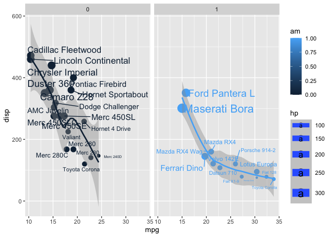

# Class 5: Data Viz with
Mudit

R has a lot of ways to makefigures and graphs in particular. One that
comes with R out of the box is called **“base” R** - the `plot()`
function

``` r
plot(cars)
```


A very popular package in this area is called **ggplot2**

Before I can use an add-on package like this, I must install it with
`install.packages("ggplot2")` command/function.

Then to use the package, I need to load it with a ‘library(ggplot2)’
call.

``` r
library(ggplot2)
ggplot(cars) + 
 aes(x=speed, y = dist) +
  geom_point()
```


For “simple” plots like this one base R code will be much shorter than
ggplot code.

Let’s fit a model and show it on my plot

``` r
ggplot(cars) + 
 aes(x=speed, y = dist) +
  geom_point() + 
  geom_smooth()
```

    `geom_smooth()` using method = 'loess' and formula = 'y ~ x'


ggplot work like a layer where each ‘+’ adds a layer

Every ggplot has at least 3 layers

- **data** (data.frame with the numbers and stuff you want to plot)
- **aes**thetics (mapping of your data columns to your plot)
- **geom**s (there are tones of these, basics are `geom_point()`,
  `geom_line()`, `geom_col()`)

``` r
head(mtcars)
```

                       mpg cyl disp  hp drat    wt  qsec vs am gear carb
    Mazda RX4         21.0   6  160 110 3.90 2.620 16.46  0  1    4    4
    Mazda RX4 Wag     21.0   6  160 110 3.90 2.875 17.02  0  1    4    4
    Datsun 710        22.8   4  108  93 3.85 2.320 18.61  1  1    4    1
    Hornet 4 Drive    21.4   6  258 110 3.08 3.215 19.44  1  0    3    1
    Hornet Sportabout 18.7   8  360 175 3.15 3.440 17.02  0  0    3    2
    Valiant           18.1   6  225 105 2.76 3.460 20.22  1  0    3    1

Make me a ggplot of the `mtcars` data set using `mpg` vs `disp`

``` r
ggplot(mtcars) + 
 aes(x=mpg, y = disp) +
  geom_point() + 
  geom_smooth()
```

    `geom_smooth()` using method = 'loess' and formula = 'y ~ x'


Make me a ggplot of the `mtcars` data set using `mpg` vs `disp` and set
the size of the points to the `hp` and et the color to `am`

``` r
ggplot(mtcars) + 
 aes(x=mpg, y = disp) +
  geom_point(aes(size = hp, col = am)) + 
  geom_smooth()
```

    `geom_smooth()` using method = 'loess' and formula = 'y ~ x'


    Now colour all points blue

    ::: {.cell}

    :::
    ::: {.cell}

    ```{.r .cell-code}
    ggplot(mtcars) + 
     aes(x=mpg, y = disp) +
      geom_point(aes(size = hp), col = "blue") + 
      geom_smooth()

<div class="cell-output cell-output-stderr">

    `geom_smooth()` using method = 'loess' and formula = 'y ~ x'

</div>

<div class="cell-output-display">


</div>

:::


    ::: {.cell}

    :::
    ::: {.cell}

    ```{.r .cell-code}
    library(ggrepel)
    ggplot(mtcars) + 
     aes(x=mpg, y = disp, size = hp, col = am, label = rownames(mtcars)) +
      geom_point() + 
      geom_smooth() + 
      facet_wrap(~am) +
      geom_text_repel()

<div class="cell-output cell-output-stderr">

    Warning: Using `size` aesthetic for lines was deprecated in ggplot2 3.4.0.
    ℹ Please use `linewidth` instead.

</div>

<div class="cell-output cell-output-stderr">

    `geom_smooth()` using method = 'loess' and formula = 'y ~ x'

</div>

<div class="cell-output cell-output-stderr">

    Warning: The following aesthetics were dropped during statistical transformation: size
    and label.
    ℹ This can happen when ggplot fails to infer the correct grouping structure in
      the data.
    ℹ Did you forget to specify a `group` aesthetic or to convert a numerical
      variable into a factor?

</div>

<div class="cell-output cell-output-stderr">

    Warning: The following aesthetics were dropped during statistical transformation: size
    and label.
    ℹ This can happen when ggplot fails to infer the correct grouping structure in
      the data.
    ℹ Did you forget to specify a `group` aesthetic or to convert a numerical
      variable into a factor?

</div>

<div class="cell-output-display">



</div>

:::

``` r
url <- "https://bioboot.github.io/bimm143_S20/class-material/up_down_expression.txt"
genes <- read.delim(url)
head(genes)
```

            Gene Condition1 Condition2      State
    1      A4GNT -3.6808610 -3.4401355 unchanging
    2       AAAS  4.5479580  4.3864126 unchanging
    3      AASDH  3.7190695  3.4787276 unchanging
    4       AATF  5.0784720  5.0151916 unchanging
    5       AATK  0.4711421  0.5598642 unchanging
    6 AB015752.4 -3.6808610 -3.5921390 unchanging

``` r
p <- ggplot(genes) + 
    aes(x=Condition1, y=Condition2, col=State) +
    geom_point()

p + scale_colour_manual( values=c("blue","gray","red") ) +
  labs(x = "Control (No Drug)", y = "Drug Treatment")
```


``` r
ggsave("myplot.pdf")
```

    Saving 7 x 5 in image

``` r
# File location online
url <- "https://raw.githubusercontent.com/jennybc/gapminder/master/inst/extdata/gapminder.tsv"

gapminder <- read.delim(url)

library(dplyr)
```


    Attaching package: 'dplyr'

    The following objects are masked from 'package:stats':

        filter, lag

    The following objects are masked from 'package:base':

        intersect, setdiff, setequal, union

``` r
gapminder_2007 <- gapminder %>% filter(year==2007)

ggplot(gapminder_2007) +
  aes(x=gdpPercap, y=lifeExp, color=continent, size=pop) +
  geom_point(alpha=0.5)
```


``` r
ggplot(gapminder_2007) + 
  geom_point(aes(x = gdpPercap, y = lifeExp,
                 size = pop), alpha=0.5) + 
  scale_size_area(max_size = 10)
```


